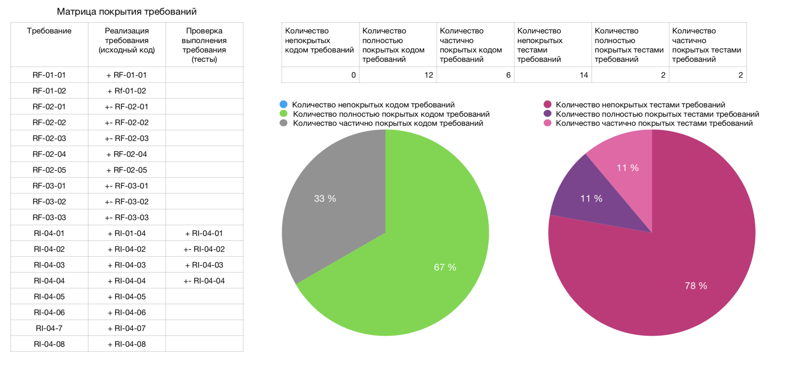

# Программный комплекс для управления лифтами в многоэтажном здании

Целью проекта является разработка ПО, обеспечивающего корректную работу лифта без ограничения на типы домов, датчиков и лифтов. При разработке данного ПО будут учитываться такие показатели, как перегруженность, задымленность, используемость лифта в конкретный момент времени и корректность его работы при вызове его как снаружи, так и изнутри.

## Документация
* Бизнес описание системы (https://drive.google.com/drive/folders/1cDHx7bCVXwtuLOkt9YuAZxF44Kf2w2Y7);
* План разработки (https://drive.google.com/drive/folders/1Im85qofHmpe4tDYiCVlpr6AObyWSmvt4);
* План управления конфигурацией (https://drive.google.com/drive/folders/1yrpyNYwauyShXt0PZvC1kDCgQ2befjyV);
* Спецификация требований (https://drive.google.com/drive/folders/10XZ8vTVIj6Tz8zw37J_XzLmv1JLv0vI8);
* Стандарт на проектирование (https://drive.google.com/drive/folders/1foSS2aFdOeeL0v-_TQNXJJJ84VCAOdiu);
* Стандарт на разработку требований (https://drive.google.com/drive/folders/1_QHxUhwq3-QRGTwV9uFw5NTaOPfd80l-).

## Режимы работы лифта

Предполагается работа ПО при следующих внешних условиях:
* нормальные;
* аномальные;
* аварийные.

Под нормальными подразумеваются условия в отсутствие задымления, не требующие вывода лифта из эксплуатации и вызова мастера. Аномальные ситуации возникают при разного рода неисправностях лифта и требуют вызова мастера. Аварийными называются сценарии работы лифта при задымлении. Работа лифта описывается состояниями — наборами значений, полученных от датчиков лифта в каждый момент времени. Переходы из состояния в состояние осуществляются через события. Набор состояний и переходов между ними отражает
различные сценарии использования лифта.

## Тестирование 
Release v0.1 6/3/2021

https://drive.google.com/drive/folders/1TDxknYfzzIzWyqWb5G0o7gXa6dYF779F

